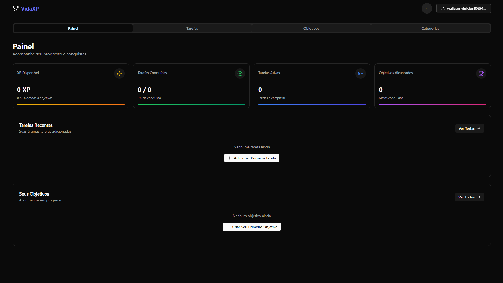

# 🧩 VidaXP



App de **hábitos/tarefas** com **gamificação** (XP/níveis). Web first (Vite + React) e empacotado com **Capacitor** para Android. Backend em **Supabase**.

🔗 **Site/App:** veja o link em **About → Website** do repositório

🧰 **Stack:** Vite (React) · TypeScript · Tailwind CSS · Capacitor (Android) · Supabase

---

## ✨ Recursos
- ✅ Lista de **hábitos** e **tarefas**
- ⭐ Recompensas de **XP** e progressão
- 🤖 Build **Android** com Capacitor
- ☁️ Dados e autenticação no **Supabase**

## 🚀 Web (desenvolvimento)
Requisitos: **Node 18+**

```bash
npm install
npm run dev
# http://localhost:5173

```

### 🔐 Variáveis de ambiente (Supabase)

Crie `.env`:

```bash
VITE_SUPABASE_URL=...
VITE_SUPABASE_ANON_KEY=...

```

## 🤖 Android (Capacitor)

```bash
# adicionar o projeto Android (uma vez)
npx cap add android

# sincronizar alterações web → nativo
npx cap copy

# abrir no Android Studio
npx cap open android

```

> Dica: após npm run build, rode npx cap copy novamente para atualizar o app nativo.
> 

## ☁️ Deploy (Web)

- **Vercel/Netlify** para a versão web.
- Configure as variáveis `VITE_SUPABASE_*` no provedor.


## 📄 Licença

MIT — veja `LICENSE`.

## 🤝 Contribuindo

Fork → Branch → PR. Commits no padrão **Conventional Commits** são bem-vindos.
